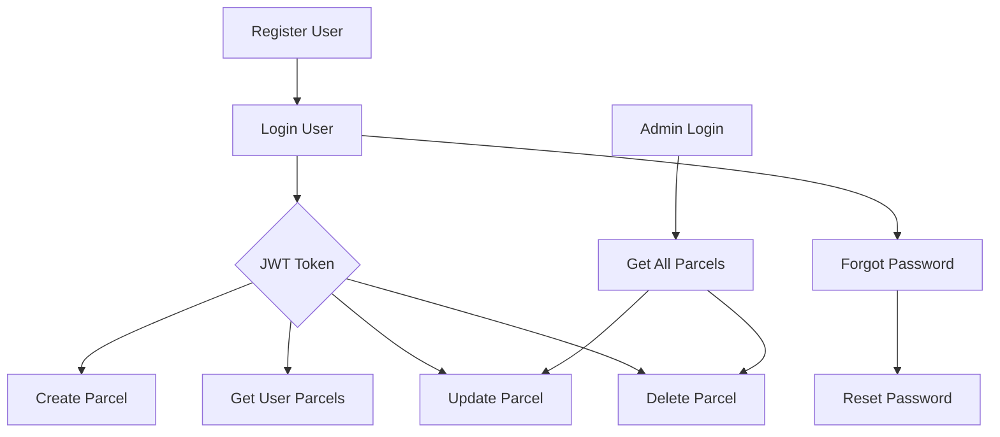

# 🚚 Courier Management Backend API

A RESTful API for managing **users, parcels, and authentication** in a courier management system.  

**Base URL:** `https://courier-management-backend-swrf.onrender.com`  

---

## 📊 API Workflow Diagram

Explanation:

Register User → Create a new user account.

Login User → Get JWT token for protected routes.

Forgot Password → Sends reset token via email.

Reset Password → Update password using token.

Create / Get / Update / Delete Parcel → CRUD operations using token.

Admin Login → View all parcels and manage any parcel.

Tokens are required for all protected routes.

📂 Project Structure
COURIER_MANAGEMENT/
│
├── config/                 # Configuration files (DB, mail)
│   ├── db.js
│   ├── mail.js
│
├── controllers/            # Route controllers
│   ├── authController.js
│   ├── parcelController.js
│
├── i18n/                   # Localization files
│   └── i18n.js
│
├── middleware/             # Auth & role middleware
│   ├── authMiddleware.js
│   ├── localizationMiddleware.js
│   ├── roleMiddleware.js
│
├── models/                 # Mongoose models
│   ├── Parcel.js
│   └── User.js
│
├── repository/             # DB query layer
│   ├── parcelRepository.js
│   └── userRepository.js
│
├── routes/                 # Route definitions
│   ├── authRouter.js
│   └── parcelsRouter.js
│
├── .env.example            # Environment variables template
├── .gitignore
├── package.json
├── package-lock.json
├── README.md               # Documentation
└── server.js               # Entry point
This structure ensures the project is organized, maintainable, and scalable.

🔹 Features
User registration & login

Forgot password & reset password

Create, view, update, and delete parcels

Admin can view and manage all parcels

🔹 Quick Start (local)

1. Install: `git clone https://github.com/HridayMahmud/courier-management-backend.git`, then `cd courier-management-backend` and `npm install`
2. Create a free database: MongoDB Atlas → create a free cluster → Database Access: add a user → Network Access: allow your IP (or 0.0.0.0/0) → Connect → Drivers → copy the connection string.
3. `cp .env.example .env` and fill in:
   - `MONGODB_URI`: the Atlas connection string (put the database name before `?`, e.g. `.../courier?retryWrites=true`)
   - `JWT_SECRET`: any long random text
   - `ADMIN_EMAIL` / `ADMIN_PASSWORD`: your first admin login
4. Create the admin: `npm run seed`
   (or `npm run seed:demo` for the admin plus demo accounts and sample parcels; never used when `NODE_ENV=production`)
5. Start: `npm run dev` (or `npm start`). The API runs on http://localhost:4000.

If a required variable is missing, the server stops and tells you which one.

Email ("forgot password"): without mail settings nothing is sent. The reset email, including the code, is printed in the server terminal.
To send real emails, either set `BREVO_API_KEY` + `EMAIL_FROM` (Brevo HTTP API; use this on Render's free plan, which blocks SMTP), or `EMAIL_USER` + `EMAIL_PASS` (Gmail App Password). A mail service that doesn't answer fails after 10 seconds with a readable message.
No email service? Set `MAIL_TRANSPORT=off`: "forgot password" then tells users to contact the admin, and the admin sets a new password (Admin → Couriers → Reset a password).

Customers sign up on the website. Couriers are created by an admin (Admin → Couriers). Admins are created with `npm run seed`.

Rate limits (per IP): login 10 per 15 min, register 10 per hour, forgot/reset password 5 per 15 min. Over the limit the API answers 429. `RATE_LIMIT=off` in .env disables them (handy for local testing; keep them on in production).

Tests: `npm test` starts a throwaway database and server and runs every file in `tests/` (no .env needed, your data is not touched).

Upgrading an existing database (data from before tracking ids): run `npm run migrate -- --dry-run` to preview, then `npm run migrate` once.
Besides parcels, it also lowercases stored emails (logins are case-insensitive now).

🔹 API Endpoints
1️⃣ Register User
POST /register

Body:
json

{
  "name": "HRIDAY MAHMUD",
  "email": "hriday@example.com",
  "password": "password123",
  "role": "customer"
}
Response:
json
{
  "message": "user registered successfully",
  "User": { /* user object */ }
}
2️⃣ Login
POST /login
Body:
json
{
  "email": "hriday@example.com",
  "password": "password123"
}
Response:
json
{
  "message": "login successful",
  "token": "<JWT_TOKEN>"
}
Use this token in Authorization: Bearer <token> header for protected routes.

3️⃣ Forgot Password
POST /forgot-password

Body:
json

{
  "email": "user@example.com"
}
Response:
json

{
  "message": "email sent"
}
4️⃣ Reset Password
POST /reset-password

Body:
json
{
  "email": "user@example.com",
  "token": "123456",
  "password": "newpassword123"
}
Response:

json

{
  "message": "Password reset successful"
}
5️⃣ Create Parcel
POST /create-parcel
Headers:
Authorization: Bearer <user_token>
Body:
json
{
  "title": "Parcel 1",
  "address": "123 Street, City",
  "weight": 5
}
Response:
{
  "message": "Parcel created successfully",
  "parcel": { /* parcel object */ }
}
6️⃣ Get User Parcels
GET /user-parcel
Headers:
Authorization: Bearer <user_token>
Response:
[
  { /* parcel object */ },
  ...
]
7️⃣ Get All Parcels (Admin Only)
GET /getall-parcels
Headers:
Authorization: Bearer <admin_token>

8️⃣ Update Parcel
PUT /update/:parcelId
Headers:
Authorization: Bearer <token>
Body:
json
{
  "title": "Updated Parcel",
  "address": "456 Street, City",
  "weight": 6
}
9️⃣ Delete Parcel
DELETE /delete/:parcelId
Headers:
Authorization: Bearer <token>
🔟 More Endpoints
All paths start with `/api`. 🔒 = needs `Authorization: Bearer <token>`.

| Method | Path | Who | What |
|---|---|---|---|
| GET | /auth/me 🔒 | any user | Logged-in user's profile |
| PATCH | /auth/me 🔒 | any user | Body `{ "name" }` changes the display name |
| PATCH | /auth/password 🔒 | any user | Body `{ "currentPassword", "newPassword" }` (min 6 characters) |
| GET | /parcel/track/:trackingId | public | Status + timeline (no addresses, names or phone) |
| GET | /parcel/:id 🔒 | owner, admin, assigned courier | Parcel details |
| PATCH | /parcel/:id/status 🔒 | admin, assigned courier | Body `{ "status": "in_transit", "note": "..." }`. Couriers can only move forward |
| PATCH | /parcel/:id/assign 🔒 | admin | Body `{ "courierId": "<id>" }` (`null` unassigns) |
| PATCH | /parcel/:id/cancel 🔒 | owner | Only while pending. Optional body `{ "reason": "..." }` |
| GET | /parcel/courier/assigned 🔒 | courier | Parcels assigned to me, optional `?status=` |
| GET | /parcel/stats 🔒 | admin | Totals, count per status, last 30 days, recent parcels |
| GET | /parcel/getall-parcels?page=1&limit=10&status=&search= 🔒 | admin | Paginated `{ items, total, page, limit, pages }`. Without query params the plain array is returned as before |
| GET | /users?role=courier 🔒 | admin | User list (couriers include `activeParcels`) |
| POST | /users/courier 🔒 | admin | Body `{ "name", "email", "password" }` creates a courier |
| PATCH | /users/password 🔒 | admin | Body `{ "email", "newPassword" }` sets a new password for a customer or courier (not for admins) |

Parcel fields: `trackingId` (auto, e.g. `SS-8F3K2Q9P`), `title`, `address` (delivery), `pickupAddress`, `receiverName`, `receiverPhone`, `weight` (number, kg), `status`, `statusHistory`, `assignedCourier`.
Status flow: `pending → picked_up → in_transit → out_for_delivery → delivered`, or `cancelled`.

🔑 Authorization
Role	Permissions
Customer	Create parcel, view own parcels, reset password
Admin	View all parcels, update/delete any parcel

All protected routes require a JWT token in the Authorization header.

⚡ Testing
Use Postman or Insomnia.

Register a user → login → copy the token.

Include token in Authorization header for protected endpoints.

Test forgot-password → reset-password flow via email.

Admin token is required for /getall-parcels.

📌 Notes
Passwords are hashed in the database.

Reset tokens expire after 15 minutes and are stored hashed.

Admin users can manage all parcels; regular users can only access their own parcels.

👨‍💻 Developer
Hriday Mahmud
GitHub Repository: Courier Management Backend [https://github.com/HridayMahmud/courier-management-backend]
